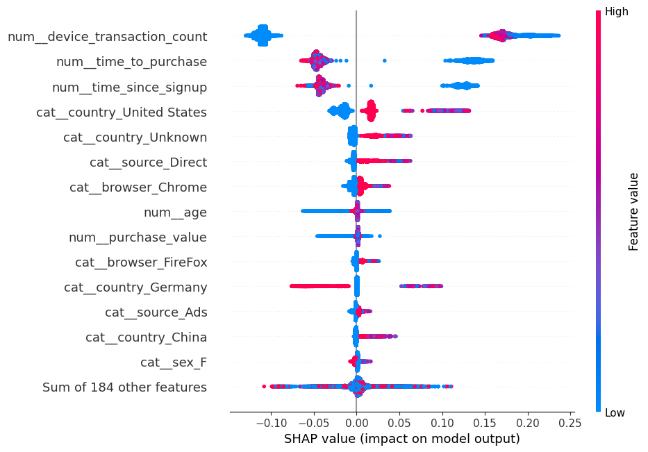

#  Improved Detection of Fraud Cases for E-Commerce and Bank Transactions

##  Project Overview

This project focuses on building reliable fraud detection models using advanced feature engineering, balancing techniques, and explainability tools.
We worked on two datasets:

* **E-Commerce Transactions (Fraud Data)**
* **Credit Card Transactions (Bank Data)**

Our goals were:

* Improve detection of fraudulent transactions
* Build interpretable models with SHAP explanations
* Compare model performance on different datasets

---

##  Project Structure

```
improved-detection-of-fraud-cases-for-e-commerice-and-bank-transactions
├── data
│   ├── processed
│   │   ├── creditcard_data_cleaned.parquet
│   │   ├── csv
│   │   │   ├── creditcard_data_cleaned.csv
│   │   │   ├── fraud_data_advanced_enriched.csv
│   │   │   ├── fraud_data_basic_features.csv
│   │   │   └── fraud_data_cleaned.csv
│   │   ├── fraud_data_advanced_enriched.parquet
│   │   ├── fraud_data_basic_features.parquet
│   │   ├── fraud_data_cleaned.parquet
│   │   ├── Xcc_balanced.parquet
│   │   ├── Xc_test.parquet
│   │   ├── Xf_balanced.parquet
│   │   ├── Xf_test.parquet
│   │   ├── ycc_balanced.parquet
│   │   ├── yc_test.parquet
│   │   ├── yf_balanced.parquet
│   │   └── yf_test.parquet
│   └── raw
│       ├── creditcard.csv
│       ├── Fraud_Data.csv
│       └── IpAddress_to_Country.csv
├── LICENSE
├── models
│   ├── feature_names_creditcard.npy
│   ├── feature_names_fraud.npy
│   ├── lr_creditcard_model.pkl
│   ├── lr_fraud_model.pkl
│   ├── preprocessor_creditcard.pkl
│   ├── preprocessor_fraud.pkl
│   ├── rf_creditcard_model.pkl
│   └── rf_fraud_model.pkl
├── notebook
│   ├── advanced_feature_engineering_final.ipynb
│   ├── convert_perquet_to_csv.ipynb
│   ├── data_preprocessing.ipynb
│   ├── eda.ipynb
│   ├── modeling.ipynb
│   └── shap_model_explain.ipynb
├── README.md
├── reports
│   ├── figures
│   │   ├── adv_features
│   │   │   ├── age_distribution.png
│   │   │   ├── device_transaction_count_distribution.png
│   │   │   ├── purchase_value_distribution.png
│   │   │   └── time_to_purchase_distribution.png
│   │   ├── bivariant
│   │   │   ├── amount_vs_class.png
│   │   │   ├── browser_fraud_rate.png
│   │   │   ├── correlation_heatmap.png
│   │   │   ├── country_fraud_rate.png
│   │   │   ├── sex_fraud_rate.png
│   │   │   └── source_fraud_rate.png
│   │   ├── eda
│   │   │   ├── fraud_rate_browser.png
│   │   │   ├── fraud_rate_country.png
│   │   │   └── fraud_rate_source.png
│   │   └── univariant
│   │       ├── age_distribution.png
│   │       ├── browser_distribution.png
│   │       ├── class_distribution.png
│   │       ├── country_distribution.png
│   │       ├── day_of_week_distribution.png
│   │       ├── device_transaction_count_distribution.png
│   │       ├── hour_of_day_distribution.png
│   │       ├── purchase_value_distribution.png
│   │       ├── sex_distribution.png
│   │       ├── signup_time_distribution.png
│   │       ├── source_distribution.png
│   │       ├── time_since_signup_distribution.png
│   │       ├── transaction_amount_distribution.png
│   │       └── user_transaction_count_distribution.png
│   └── plots
│       ├── credit_card.png
│       ├── image.png
│       └── shap.png
├── requirements.txt
├── src
│   ├── advanced
│   │   ├── eda_grouped_visuals.py
│   │   ├── fraud_clustering_analysis.py
│   │   ├── fraud_feature_engineering.py
│   │   ├── fraud_risk_scoring.py
│   │   ├── __init__.py
│   │   ├── outlier_detection.py
│   │   └── __pycache__
│   │       ├── eda_grouped_visuals.cpython-310.pyc
│   │       ├── fraud_clustering_analysis.cpython-310.pyc
│   │       ├── fraud_feature_engineering.cpython-310.pyc
│   │       ├── fraud_risk_scoring.cpython-310.pyc
│   │       ├── __init__.cpython-310.pyc
│   │       └── outlier_detection.cpython-310.pyc
│   ├── data_loader.py
│   ├── eda.py
│   ├── feature_engineering.py
│   ├── __init__.py
│   ├── modeling
│   │   ├── data_preparation.py
│   │   ├── __init__.py
│   │   └── train_and_evaulate.py
│   ├── preprocessing.py
│   ├── __pycache__
│   │   ├── __init__.cpython-310.pyc
│   │   └── transformers.cpython-310.pyc
│   ├── transformers.py
│   └── utils.py
└── test
```

---

##  Key Components

###  Data Preprocessing

* Cleaned numerical & categorical features
* Feature engineering (e.g., time since signup, transaction counts)
* Balancing with **SMOTE** to handle class imbalance

---

###  Model Training

* Random Forest Classifier with tuned hyperparameters
* Separate models for Fraud Data and Credit Card Data
* Performance Metrics: **Accuracy, Precision, Recall, F1-Score**

---
# sample images
##  Sample Plot  



---

###  Model Explainability

* **SHAP (SHapley Additive ExPlanations)** for feature importance
* Global analysis with Beeswarm plots
* Local instance analysis with Waterfall plots

---

##  Performance Summary

| Dataset     | Accuracy | Precision | Recall | F1-Score |
| ----------- | -------- | --------- | ------ | -------- |
| Fraud Data  | \~87%    | \~92%     | \~79%  | \~86%    |
| Credit Card | \~99%    | \~90%     | \~82%  | \~86%    |

---

##  Insights & Outcomes

* Class imbalance strongly affects fraud detection; balancing improves recall
* SHAP helped uncover key features (e.g., `purchase_value`, `V17`) influencing fraud risk
* E-Commerce fraud is harder to predict than credit card fraud due to noisier data

---
## develped by 
Nurye Nigus 
+251929404324
nurye.nigus.me@gmail.com