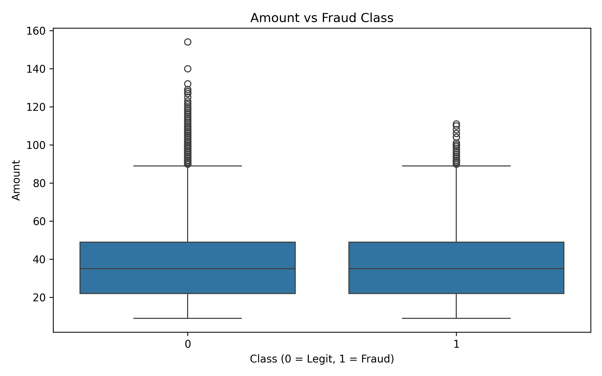
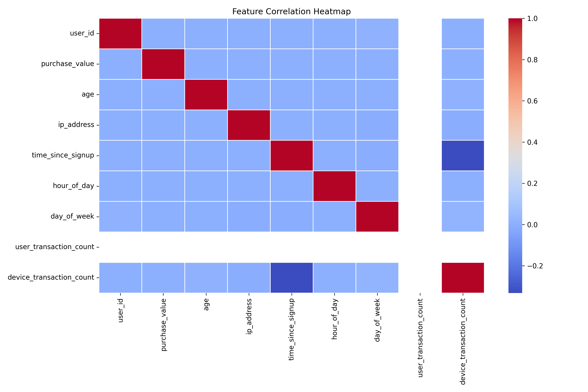
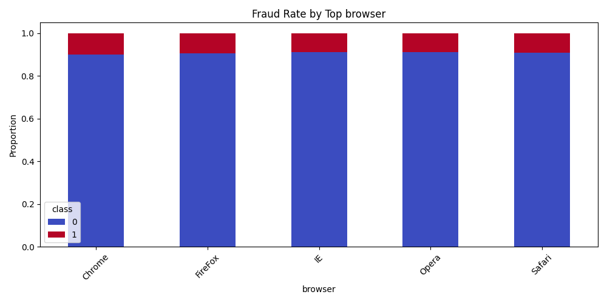

#  Improved Detection of Fraud Cases for E-Commerce and Bank Transactions

##  Project Overview

This project focuses on building reliable fraud detection models using advanced feature engineering, balancing techniques, and explainability tools.
We worked on two datasets:

* **E-Commerce Transactions (Fraud Data)**
* **Credit Card Transactions (Bank Data)**

Our goals were:

* Improve detection of fraudulent transactions
* Build interpretable models with SHAP explanations
* Compare model performance on different datasets

---

##  Project Structure

```
├── data/
│   ├── raw/                     # Raw data files
│   ├── processed/               # Cleaned, transformed, balanced datasets
├── models/
│   ├── rf_fraud_model.pkl       # Trained RandomForest on Fraud Data
│   ├── rf_creditcard_model.pkl  # Trained RandomForest on CreditCard Data
├── src/
│   ├── transformers.py          # Preprocessing + Balancing utilities
│   ├── model_utils.py           # Model training + evaluation utilities
├── notebook/
│   ├── data_preprocessing.ipynb # Data cleaning & feature engineering
│   ├── modeling.ipynb           # Model training & evaluation
│   ├── shap_model_explain.ipynb # SHAP analysis for model explainability
├── README.md
```

---

##  Key Components

###  Data Preprocessing

* Cleaned numerical & categorical features
* Feature engineering (e.g., time since signup, transaction counts)
* Balancing with **SMOTE** to handle class imbalance

---

###  Model Training

* Random Forest Classifier with tuned hyperparameters
* Separate models for Fraud Data and Credit Card Data
* Performance Metrics: **Accuracy, Precision, Recall, F1-Score**

---
# sample images
## 🔍 Sample SHAP Summary Plot  




---

###  Model Explainability

* **SHAP (SHapley Additive ExPlanations)** for feature importance
* Global analysis with Beeswarm plots
* Local instance analysis with Waterfall plots

---

##  Performance Summary

| Dataset     | Accuracy | Precision | Recall | F1-Score |
| ----------- | -------- | --------- | ------ | -------- |
| Fraud Data  | \~87%    | \~92%     | \~79%  | \~86%    |
| Credit Card | \~99%    | \~90%     | \~82%  | \~86%    |

---

##  Insights & Outcomes

* Class imbalance strongly affects fraud detection; balancing improves recall
* SHAP helped uncover key features (e.g., `purchase_value`, `V17`) influencing fraud risk
* E-Commerce fraud is harder to predict than credit card fraud due to noisier data

---
## develped by 
Nurye Nigus 
+251929404324
nurye.nigus.me@gmail.com